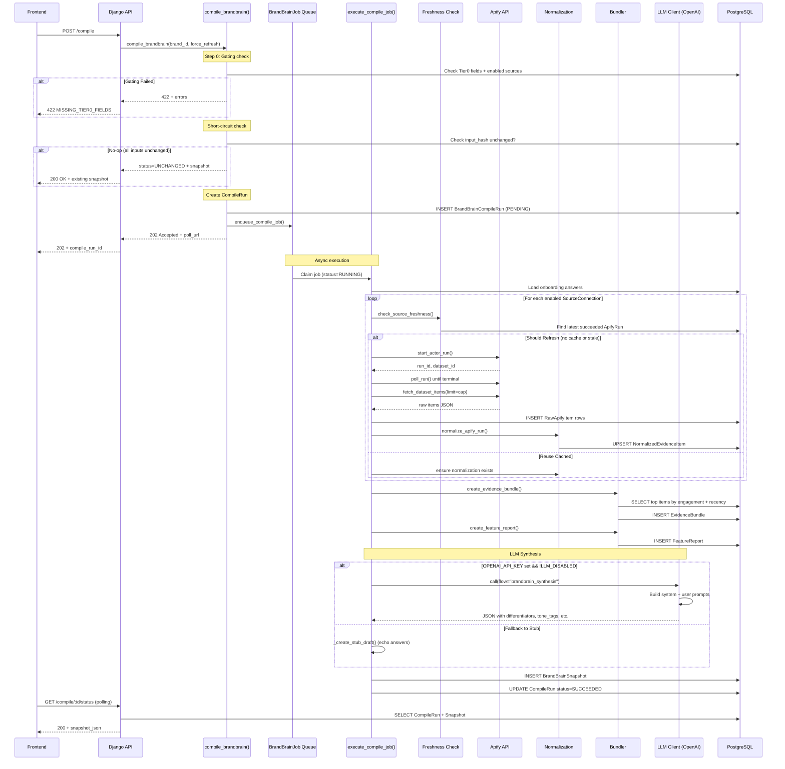

# BrandBrain Pipeline World Model

**Author:** Code Audit (PR-7)
**Date:** 2026-01-14
**Purpose:** Evidence-backed world model for v2 spec planning

---

## 1. End-to-End Pipeline Map

### Overview

The BrandBrain compile pipeline transforms brand onboarding answers and social media evidence into a synthesized "BrandBrain" snapshot containing positioning, voice, and content guidance.



### Key Flow Characteristics

| Phase | Duration Target | I/O Type | Failure Mode |
|-------|----------------|----------|--------------|
| Kickoff (API) | <200ms | HTTP | 422 gating, 500 internal |
| Evidence per source | ~30-60s | Apify HTTP | Timeout, actor failure |
| Bundling | <100ms | DB | None expected |
| LLM Synthesis | 5-15s | OpenAI API | Timeout, invalid JSON |
| Snapshot creation | <50ms | DB | None expected |

---

## 2. Entry Points + Contracts

### API Endpoints

| Endpoint | Method | Type | P95 Target | Response Codes |
|----------|--------|------|------------|----------------|
| `/api/brands/:id/brandbrain/compile` | POST | Work | <200ms | 202, 200 (UNCHANGED), 422, 404, 500 |
| `/api/brands/:id/brandbrain/compile/:run_id/status` | GET | Read | <30ms | 200, 400, 404 |
| `/api/brands/:id/brandbrain/latest` | GET | Read | <50ms | 200, 404 |
| `/api/brands/:id/brandbrain/history` | GET | Read | <100ms | 200, 404 |
| `/api/brands/:id/brandbrain/overrides` | GET | Read | <30ms | 200, 404 |
| `/api/brands/:id/brandbrain/overrides` | PATCH | Work | <100ms | 200, 400, 404 |

**Source:** [kairo/brandbrain/api/views.py](kairo/brandbrain/api/views.py)

### Endpoint Contracts

#### POST /compile - Request
```json
{
  "force_refresh": false  // Optional, default false
}
```

#### POST /compile - Response (202 Accepted)
```json
{
  "compile_run_id": "uuid",
  "status": "PENDING",
  "poll_url": "/api/brands/:id/brandbrain/compile/:run_id/status"
}
```

#### POST /compile - Response (200 OK - Short-circuit)
```json
{
  "compile_run_id": "uuid",
  "status": "UNCHANGED",
  "snapshot": {
    "snapshot_id": "uuid",
    "brand_id": "uuid",
    "created_at": "iso-datetime",
    "snapshot_json": { ... }
  }
}
```

#### GET /status - Response (SUCCEEDED)
```json
{
  "compile_run_id": "uuid",
  "status": "SUCCEEDED",
  "evidence_status": {
    "reused": [...],
    "refreshed": [...],
    "skipped": [...],
    "failed": [...]
  },
  "snapshot": {
    "snapshot_id": "uuid",
    "created_at": "iso-datetime",
    "snapshot_json": { ... }
  }
}
```

---

## 3. Snapshot Schema - What Exists Today

### BrandBrainSnapshot.snapshot_json Structure

**Source:** [kairo/brandbrain/compile/worker.py:517-559](kairo/brandbrain/compile/worker.py#L517-L559)

```json
{
  "_stub": false,
  "_note": "LLM synthesized",
  "_llm_meta": {
    "provider": "openai",
    "model": "gpt-5.1-turbo",
    "used": true,
    "tokens_in": 1234,
    "tokens_out": 567,
    "error": null
  },
  "positioning": {
    "what_we_do": {
      "value": "string",
      "confidence": 0.9,
      "sources": [{"type": "llm", "id": "tier0.what_we_do"}],
      "locked": false,
      "override_value": null
    },
    "who_for": { ... },
    "differentiators": [
      {"value": "string", "confidence": 0.7},
      ...
    ]
  },
  "voice": {
    "cta_policy": { "value": "soft|moderate|aggressive", ... },
    "tone_tags": ["professional", "friendly", "bold"],
    "taboos": ["string", ...],
    "risk_boundaries": ["string", ...]
  },
  "content": {
    "content_pillars": [
      {"name": "string", "description": "string"},
      ...
    ],
    "proof_types": ["case_study", "testimonial", "data"]
  },
  "meta": {
    "content_goal": { "value": "string", ... },
    "evidence_summary": {
      "bundle_id": "uuid",
      "item_count": 40
    },
    "feature_report_id": "uuid"
  }
}
```

### Field Structure Pattern

Every editable field follows:
```json
{
  "value": "actual content",
  "confidence": 0.0-1.0,
  "sources": [{"type": "llm|answer|evidence", "id": "source_ref"}],
  "locked": false,
  "override_value": null
}
```

### Stub vs LLM Output

| Field | `_stub: true` | `_stub: false` |
|-------|---------------|----------------|
| `positioning.differentiators` | Empty `[]` | 3-5 items from LLM |
| `voice.tone_tags` | Empty `[]` | 3-5 adjectives |
| `voice.taboos` | Empty `[]` | 2-3 items |
| `content.content_pillars` | Empty `[]` | 3-5 themes |
| confidence | 0.9 (if answer exists), 0.0 (if not) | 0.5-0.9 based on evidence |

---

## 4. Evidence Ingestion - Data Collected Per Source

### Apify Actor Registry

**Source:** [kairo/brandbrain/actors/registry.py](kairo/brandbrain/actors/registry.py)

| Platform | Capability | Actor ID | Cap Field | Default Cap | Notes |
|----------|------------|----------|-----------|-------------|-------|
| instagram | posts | `apify~instagram-scraper` | `resultsLimit` | 8 | addParentData=false |
| instagram | reels | `apify~instagram-reel-scraper` | `resultsLimit` | 6 | includeTranscript=true CRITICAL |
| linkedin | company_posts | `apimaestro~linkedin-company-posts` | `limit` | 6 | Identifier = company slug |
| linkedin | profile_posts | `apimaestro~linkedin-profile-posts` | `limit` | 6 | **UNVALIDATED, FEATURE FLAG** |
| tiktok | profile_videos | `clockworks~tiktok-scraper` | `resultsPerPage` | 6 | Handle without @ |
| youtube | channel_videos | `streamers~youtube-scraper` | `maxResults` | 6 | Shorts/streams excluded |
| web | crawl_pages | `apify~website-content-crawler` | `maxCrawlPages` | 3 | maxCrawlDepth=1 |

### Raw to Normalized Pipeline

```
SourceConnection
     │
     ▼
┌──────────────────┐
│  ApifyRun        │  ← run_id, dataset_id, status, timestamps
│  (1 per refresh) │
└────────┬─────────┘
         │
         ▼
┌──────────────────┐
│  RawApifyItem    │  ← item_index, raw_json (actor output as-is)
│  (N per run)     │
└────────┬─────────┘
         │
         ▼
┌──────────────────────────────────────────────────────────────┐
│  Normalization Adapters                                       │
│  normalize_instagram_post(), normalize_linkedin_post(), etc. │
└────────┬─────────────────────────────────────────────────────┘
         │
         ▼
┌────────────────────────┐
│  NormalizedEvidenceItem │  ← platform, content_type, text_primary,
│  (dedupe by external_id │     metrics_json, published_at, canonical_url
│   or canonical_url)     │
└─────────────────────────┘
```

### NormalizedEvidenceItem Schema

**Source:** [kairo/brandbrain/models.py:161-251](kairo/brandbrain/models.py#L161-L251)

| Field | Type | Description |
|-------|------|-------------|
| `platform` | enum | instagram, linkedin, tiktok, youtube, web |
| `content_type` | enum | post, reel, text_post, short_video, video, web_page |
| `external_id` | string? | Platform-specific ID (for dedupe) |
| `canonical_url` | URL | Permanent link to content |
| `published_at` | datetime? | When content was published |
| `author_ref` | string | Handle/username |
| `text_primary` | text | Caption/body/title (main content) |
| `text_secondary` | text? | Description/additional text |
| `hashtags` | JSON array | Extracted hashtags |
| `metrics_json` | JSON | likes, comments, shares, views |
| `media_json` | JSON | image/video URLs, thumbnails |
| `flags_json` | JSON | `is_collection_page`, `has_transcript`, `is_low_value` |
| `raw_refs` | JSON array | `[{apify_run_uuid, raw_item_id}]` provenance |

### Dedupe Keys by Platform

| Platform | Dedupe Key |
|----------|-----------|
| instagram | `external_id` (post/reel ID) |
| linkedin | `external_id` (urn) |
| tiktok | `external_id` (video ID) |
| youtube | `external_id` (video ID) |
| web | `canonical_url` (normalized URL) |

---

## 5. Caching / Idempotency / Billing Risk Decision Table

### TTL-Based Freshness Decision

**Source:** [kairo/brandbrain/freshness.py](kairo/brandbrain/freshness.py)

| Condition | Decision | Cost Risk | Log Marker |
|-----------|----------|-----------|------------|
| `force_refresh=True` | REFRESH | HIGH | `action=refresh reason=force_refresh` |
| No successful ApifyRun exists | REFRESH | HIGH | `action=refresh reason=No_successful_run_exists` |
| Cached run > TTL hours old | REFRESH | HIGH | `action=refresh reason=Cached_run_is_stale` |
| Cached run ≤ TTL hours old | REUSE | LOW | `action=reuse reason=Cached_run_is_fresh` |
| Capability disabled (feature flag) | SKIP | NONE | `action=skip reason=capability_disabled` |

### Configuration

**Source:** [kairo/brandbrain/caps.py](kairo/brandbrain/caps.py)

| Setting | Environment Variable | Default |
|---------|---------------------|---------|
| TTL (hours) | `BRANDBRAIN_APIFY_RUN_TTL_HOURS` | 24 |
| Instagram posts cap | `BRANDBRAIN_CAP_IG_POSTS` | 8 |
| Instagram reels cap | `BRANDBRAIN_CAP_IG_REELS` | 6 |
| LinkedIn cap | `BRANDBRAIN_CAP_LI` | 6 |
| TikTok cap | `BRANDBRAIN_CAP_TT` | 6 |
| YouTube cap | `BRANDBRAIN_CAP_YT` | 6 |
| Web cap | `BRANDBRAIN_CAP_WEB` | 3 |
| Global max items | `BRANDBRAIN_MAX_NORMALIZED_ITEMS` | 40 |

### Short-Circuit Logic

**Source:** [kairo/brandbrain/compile/service.py:149-224](kairo/brandbrain/compile/service.py#L149-L224)

Compile is a no-op if ALL conditions are true:
1. Latest snapshot exists for brand
2. All enabled sources have successful ApifyRuns within TTL
3. `hash(onboarding_answers_json)` matches snapshot's stored hash
4. `hash(overrides_json + pinned_paths)` matches
5. `prompt_version` and `model` match current config

No-op returns immediately with `status=UNCHANGED` and existing snapshot.

### Two-Layer Cap Enforcement

| Layer | Where Enforced | Purpose |
|-------|----------------|---------|
| Actor input | `spec.build_input(source, cap)` | Limit items actor fetches |
| Dataset fetch | `fetch_dataset_items(limit=cap)` | Safety net if actor ignores cap |

---

## 6. LLM Usage Proof - Where and How It's Called

### Call Site

**Source:** [kairo/brandbrain/compile/worker.py:388-569](kairo/brandbrain/compile/worker.py#L388-L569)

```python
# In execute_compile_job(), after evidence bundling:
if llm_disabled or not openai_key_present:
    draft_json = _create_stub_draft(answers, bundle, feature_report)
else:
    draft_json, llm_meta = _synthesize_brandbrain(
        brand_id=brand_id,
        compile_run_id=compile_run_id,
        answers=answers,
        bundle=bundle,
        feature_report=feature_report,
    )
```

### LLM Client

**Source:** [kairo/hero/llm_client.py](kairo/hero/llm_client.py)

| Config | Environment Variable | Default |
|--------|---------------------|---------|
| API Key | `OPENAI_API_KEY` | Required for LLM |
| Disabled | `LLM_DISABLED` | `false` |
| Model (heavy) | `KAIRO_LLM_HEAVY_MODEL` | `gpt-5.1-turbo` |
| Temperature | `KAIRO_LLM_TEMP_HEAVY` | `0.0` (deterministic) |

### Prompt Structure

**System Prompt (abbreviated):**
```
You are a brand strategist AI. Given a company's onboarding answers
and evidence from their social media presence, synthesize a BrandBrain snapshot.

Output valid JSON with this exact structure: { positioning, voice, content, meta }

Guidelines:
- differentiators: 3-5 unique selling points based on evidence
- tone_tags: 3-5 adjectives describing brand voice
- taboos: 2-3 things the brand should never say/do
- risk_boundaries: 2-3 limits on controversial topics
- content_pillars: 3-5 main content themes with descriptions
- confidence: 0.9 for strong evidence, 0.7 for inferred, 0.5 for assumed
```

**User Prompt (template):**
```
## Onboarding Answers
**What we do:** {what_we_do}
**Who for:** {who_for}
**Primary goal:** {primary_goal}
**CTA posture:** {cta_posture}

## Evidence from Social Media ({N} items)
1. [instagram/post] First 200 chars of text_primary...
2. [linkedin/text_post] ...
...

Synthesize a BrandBrain snapshot based on this information.
```

### Observability

Every LLM call is logged via `kairo.hero.observability_store`:
- `brand_id`
- `flow` = "brandbrain_synthesis"
- `run_id` = compile_run_id
- `tokens_in`, `tokens_out`
- `model`
- `latency_ms`

---

## 7. Performance and Failure Modes

### Performance Targets

| Operation | P95 Target | Notes |
|-----------|------------|-------|
| POST /compile kickoff | <200ms | Enqueue only, no blocking work |
| GET /status | <30ms | Pure DB read |
| GET /latest | <50ms | 2 queries with select_related |
| Apify actor run | ~30-60s | Network-bound, varies by platform |
| LLM synthesis | 5-15s | Token count dependent |
| Total compile (async) | ~60-120s | Depends on source count |

### Failure Modes

| Failure | Handling | User Impact |
|---------|----------|-------------|
| Apify actor timeout | `ApifyRun.status=TIMED_OUT` | Source marked failed, compile continues |
| Apify actor failure | `ApifyRun.status=FAILED` | Source marked failed, compile continues |
| LLM timeout/error | Fallback to `_create_stub_draft()` | `_stub=true`, no synthesized fields |
| Invalid JSON from LLM | Fallback to stub | Same as above |
| No API key | Fallback to stub | Same as above |
| Gating failure | 422 response immediately | Compile not started |
| DB error | 500 + exception logged | Compile fails |

### Job Queue Resilience

**Source:** [kairo/brandbrain/models.py:479-567](kairo/brandbrain/models.py#L479-L567)

| Feature | Implementation |
|---------|----------------|
| Durability | DB-backed `BrandBrainJob` table |
| Retry | `max_attempts=3`, exponential backoff |
| Stale lock detection | `locked_at` timestamp threshold |
| Crash recovery | Jobs survive restart, worker re-claims PENDING |

---

## 8. Gating Rules for Compile

### Gating Check

**Source:** [kairo/brandbrain/compile/service.py:83-133](kairo/brandbrain/compile/service.py#L83-L133)

```python
TIER0_REQUIRED_FIELDS = [
    "tier0.what_we_do",
    "tier0.who_for",
    "tier0.primary_goal",
    "tier0.cta_posture",
]

def check_compile_gating(brand_id: UUID) -> GatingResult:
    # Check 1: All Tier0 required fields present and non-empty
    # Check 2: At least one enabled SourceConnection exists
```

### Gating Error Codes

| Code | Message | Cause |
|------|---------|-------|
| `MISSING_TIER0_FIELDS` | "Missing required Tier0 fields: ..." | Onboarding incomplete |
| `NO_ENABLED_SOURCES` | "At least one enabled SourceConnection is required" | No sources linked |

### Capability Gating (Feature Flags)

| Capability | Feature Flag | Default |
|------------|--------------|---------|
| linkedin.profile_posts | `BRANDBRAIN_ENABLE_LINKEDIN_PROFILE_POSTS` | DISABLED |
| All others | None | ENABLED |

---

## 9. What Needs to Change for v2

> **Note:** This section lists gaps and opportunities identified during the audit.
> **No implementation details or timelines are provided.**

### Snapshot Schema

- [ ] Add `version` field to snapshot_json for schema evolution
- [ ] Define stable field paths for overrides compatibility
- [ ] Add `provenance` field linking each value to specific evidence items

### Evidence Pipeline

- [ ] Add incremental/delta ingestion (only fetch new items since last run)
- [ ] Add transcript extraction for TikTok and YouTube (currently Instagram reels only)
- [ ] Add engagement scoring to raw items during normalization (not just bundling)

### LLM Synthesis

- [ ] Replace single mega-prompt with multi-step synthesis (positioning → voice → content)
- [ ] Add structured output validation (Pydantic schema enforcement)
- [ ] Add retry with temperature bump on JSON parse failure
- [ ] Add model version pinning to snapshot for reproducibility

### Caching & Billing

- [ ] Add per-brand Apify budget tracking (monthly caps)
- [ ] Add source-level TTL configuration (some sources change faster)
- [ ] Add webhook triggers for external compile requests

### QA & Validation

- [ ] Implement `qa_report_json` checks (currently stub)
- [ ] Add confidence threshold gating (reject low-confidence outputs)
- [ ] Add diff computation for `diff_from_previous_json`

### Performance

- [ ] Parallelize source ingestion (currently sequential)
- [ ] Add bundle caching (skip re-bundling if evidence unchanged)
- [ ] Add streaming compile status (WebSocket or SSE)

### API

- [ ] Add `PATCH /snapshot` for field-level overrides with recompile
- [ ] Add `DELETE /sources/:id` endpoint
- [ ] Add bulk source creation endpoint for onboarding

---

## Appendix A: Model References

| Model | Location | Purpose |
|-------|----------|---------|
| `BrandOnboarding` | [models.py:35-69](kairo/brandbrain/models.py#L35-L69) | Tiered Q&A answers |
| `SourceConnection` | [models.py:77-154](kairo/brandbrain/models.py#L77-L154) | Platform source config |
| `NormalizedEvidenceItem` | [models.py:161-251](kairo/brandbrain/models.py#L161-L251) | Normalized evidence |
| `EvidenceBundle` | [models.py:258-291](kairo/brandbrain/models.py#L258-L291) | Grouped evidence for compile |
| `FeatureReport` | [models.py:293-327](kairo/brandbrain/models.py#L293-L327) | Deterministic stats |
| `BrandBrainCompileRun` | [models.py:334-387](kairo/brandbrain/models.py#L334-L387) | Compile job tracking |
| `BrandBrainOverrides` | [models.py:389-418](kairo/brandbrain/models.py#L389-L418) | User field overrides |
| `BrandBrainSnapshot` | [models.py:420-458](kairo/brandbrain/models.py#L420-L458) | Final compiled output |
| `BrandBrainJob` | [models.py:479-567](kairo/brandbrain/models.py#L479-L567) | Durable job queue |
| `ApifyRun` | [apify/models.py](kairo/integrations/apify/models.py) | Apify run tracking |
| `RawApifyItem` | [apify/models.py](kairo/integrations/apify/models.py) | Raw actor output |

---

## Appendix B: Key Functions Reference

| Function | Location | Purpose |
|----------|----------|---------|
| `compile_brandbrain()` | [service.py:247-357](kairo/brandbrain/compile/service.py#L247-L357) | Main compile orchestrator |
| `execute_compile_job()` | [worker.py:58-329](kairo/brandbrain/compile/worker.py#L58-L329) | Async job execution |
| `check_source_freshness()` | [freshness.py:52-127](kairo/brandbrain/freshness.py#L52-L127) | TTL decision |
| `ingest_source()` | [ingestion/service.py:100-352](kairo/brandbrain/ingestion/service.py#L100-L352) | End-to-end ingestion |
| `normalize_apify_run()` | [normalization/__init__.py](kairo/brandbrain/normalization/__init__.py) | Raw → Normalized |
| `create_evidence_bundle()` | [bundling/service.py:99-394](kairo/brandbrain/bundling/service.py#L99-L394) | Bundle selection |
| `_synthesize_brandbrain()` | [worker.py:388-569](kairo/brandbrain/compile/worker.py#L388-L569) | LLM synthesis |
| `check_compile_gating()` | [service.py:83-133](kairo/brandbrain/compile/service.py#L83-L133) | Gating validation |
