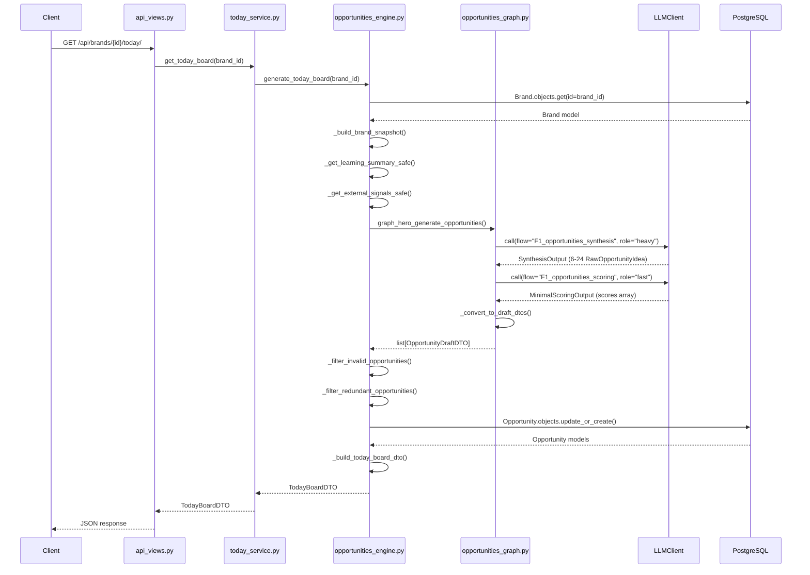

# Opportunities Engine: Phase 0 Backend World Model

**Audit Date:** 2026-01-15
**Auditor:** Claude Opus 4.5
**Scope:** Read-only codebase inspection of the Opportunities/Today Board system

---

## 1. Executive Summary

### What Exists (Real Implementation)

The Opportunities engine is **fully implemented** with a coherent end-to-end pipeline:

| Component | Status | Location |
|-----------|--------|----------|
| **Opportunity Model** | REAL - persisted to DB | [kairo/core/models.py:318-388](kairo/core/models.py#L318-L388) |
| **OpportunityDTO** | REAL - canonical API contract | [kairo/hero/dto.py:123-148](kairo/hero/dto.py#L123-L148) |
| **OpportunityDraftDTO** | REAL - graph→engine contract | [kairo/hero/dto.py:151-181](kairo/hero/dto.py#L151-L181) |
| **TodayBoardDTO** | REAL - API response shape | [kairo/hero/dto.py:475-484](kairo/hero/dto.py#L475-L484) |
| **Opportunities Engine** | REAL - full orchestration | [kairo/hero/engines/opportunities_engine.py:65-261](kairo/hero/engines/opportunities_engine.py#L65-L261) |
| **Opportunities Graph** | REAL - 2-node LLM graph | [kairo/hero/graphs/opportunities_graph.py:724-819](kairo/hero/graphs/opportunities_graph.py#L724-L819) |
| **Scoring/Validation** | REAL - rubric-based | [kairo/hero/graphs/opportunities_graph.py:394-581](kairo/hero/graphs/opportunities_graph.py#L394-L581) |
| **Deduplication** | REAL - Jaccard similarity | [kairo/hero/engines/opportunities_engine.py:402-459](kairo/hero/engines/opportunities_engine.py#L402-L459) |
| **Degraded Mode** | REAL - stub fallback | [kairo/hero/engines/opportunities_engine.py:543-703](kairo/hero/engines/opportunities_engine.py#L543-L703) |

### What is Placeholder/Stub

| Component | Status | Evidence |
|-----------|--------|----------|
| **External Signals** | EMPTY FALLBACK - signals service returns empty bundle | [kairo/hero/engines/opportunities_engine.py:354-366](kairo/hero/engines/opportunities_engine.py#L354-L366) |
| **Learning Summary** | IN-MEMORY STUB - no execution events yet | [kairo/hero/dto.py:363-380](kairo/hero/dto.py#L363-L380) (DTO exists, engine returns default) |
| **Decision Endpoint** | PARTIAL - `stub_brand_id` hardcoded | [kairo/hero/api_views.py:355-356](kairo/hero/api_views.py#L355-L356) |

### What Actually Runs

1. `GET /api/brands/{brand_id}/today/` - **FULLY FUNCTIONAL** - calls engine → graph → LLM → persist → return
2. `POST /api/brands/{brand_id}/today/regenerate/` - **FULLY FUNCTIONAL** - same as above
3. `POST /api/opportunities/{opportunity_id}/decision/` - **WIRED** but uses stub brand_id
4. Stub fallback opportunities are **persisted to DB** for F2 flow continuity

---

## 2. Entry Points

### Today Board Endpoints

| Method | Path | View | Response Shape |
|--------|------|------|----------------|
| GET | `/api/brands/{brand_id}/today/` | `get_today_board` | `TodayBoardDTO` |
| POST | `/api/brands/{brand_id}/today/regenerate/` | `regenerate_today_board` | `RegenerateResponseDTO` wrapping `TodayBoardDTO` |

**Source:** [kairo/hero/urls.py:26-35](kairo/hero/urls.py#L26-L35)

#### GET /api/brands/{brand_id}/today/

```python
# kairo/hero/api_views.py:87-114
@require_GET
def get_today_board(request: HttpRequest, brand_id: str) -> JsonResponse:
    brand_uuid = UUID(brand_id)
    dto = today_service.get_today_board(brand_uuid)
    return JsonResponse(dto.model_dump(mode="json"))
```

**Auth:** None currently (no `@require_auth` decorator)
**Response:** `TodayBoardDTO.model_dump(mode="json")`

#### POST /api/brands/{brand_id}/today/regenerate/

```python
# kairo/hero/api_views.py:117-150
@csrf_exempt
@require_http_methods(["POST"])
def regenerate_today_board(request: HttpRequest, brand_id: str) -> JsonResponse:
    today_board = today_service.regenerate_today_board(brand_uuid)
    dto = RegenerateResponseDTO(status="regenerated", today_board=today_board)
    return JsonResponse(dto.model_dump(mode="json"))
```

### Decision Endpoints

| Method | Path | View | Notes |
|--------|------|------|-------|
| POST | `/api/opportunities/{opportunity_id}/decision/` | `record_opportunity_decision` | Stub brand_id |
| POST | `/api/packages/{package_id}/decision/` | `record_package_decision` | Stub brand_id |
| POST | `/api/variants/{variant_id}/decision/` | `record_variant_decision` | Stub brand_id |

**Source:** [kairo/hero/urls.py:67-81](kairo/hero/urls.py#L67-L81)

**Known Issue:** All decision endpoints use a hardcoded `stub_brand_id`:
```python
# kairo/hero/api_views.py:355-356
stub_brand_id = UUID("12345678-1234-5678-1234-567812345678")
```

---

## 3. Data Model

### Core Tables

```
┌─────────────────────────────────────────────────────────────────────────┐
│                              opportunity                                 │
├─────────────────────────────────────────────────────────────────────────┤
│ id              UUID PK (deterministic via uuid5)                       │
│ brand_id        UUID FK → brand                                         │
│ type            VARCHAR(50) [trend|evergreen|competitive|campaign]      │
│ score           FLOAT nullable (0-100)                                  │
│ score_explanation TEXT                                                  │
│ title           VARCHAR(500)                                            │
│ angle           TEXT                                                    │
│ source          VARCHAR(255)                                            │
│ source_url      VARCHAR(2000)                                           │
│ persona_id      UUID FK → persona (nullable)                            │
│ pillar_id       UUID FK → content_pillar (nullable)                     │
│ primary_channel VARCHAR(50) [linkedin|x|...]                            │
│ suggested_channels JSONB (array)                                        │
│ is_pinned       BOOLEAN default false                                   │
│ is_snoozed      BOOLEAN default false                                   │
│ snoozed_until   TIMESTAMP nullable                                      │
│ created_by_user_id UUID nullable                                        │
│ created_via     VARCHAR(50) [manual|ai_suggested|imported]              │
│ last_touched_at TIMESTAMP nullable                                      │
│ metadata        JSONB                                                   │
│ created_at      TIMESTAMP                                               │
│ updated_at      TIMESTAMP                                               │
├─────────────────────────────────────────────────────────────────────────┤
│ INDEXES:                                                                │
│   (brand, created_at)                                                   │
│   (brand, is_pinned, is_snoozed)                                        │
│   (brand, type)                                                         │
└─────────────────────────────────────────────────────────────────────────┘
```

**Source:** [kairo/core/models.py:318-388](kairo/core/models.py#L318-L388)

### Related Enums

```python
# kairo/core/enums.py:24-29
class OpportunityType(models.TextChoices):
    TREND = "trend"
    EVERGREEN = "evergreen"
    COMPETITIVE = "competitive"
    CAMPAIGN = "campaign"

# kairo/core/enums.py:101-115
class DecisionType(models.TextChoices):
    OPPORTUNITY_PINNED = "opportunity_pinned"
    OPPORTUNITY_SNOOZED = "opportunity_snoozed"
    OPPORTUNITY_IGNORED = "opportunity_ignored"
    # ... plus package/variant decisions
```

### Entity Relationships

```
Brand (1) ──────────────────────┬─────────────────┐
    │                           │                 │
    │ FK                        │ FK              │ FK
    ▼                           ▼                 ▼
Opportunity (N) ────────► ContentPackage (N) ──► Variant (N)
    │                      │
    │ FK (optional)        │ FK (optional)
    ▼                      ▼
Persona                  Persona
ContentPillar            ContentPillar
```

---

## 4. Pipeline

### Step-by-Step Flow

```
1. HTTP Request
   GET /api/brands/{brand_id}/today/
   └─► api_views.get_today_board()  [api_views.py:87]
       └─► today_service.get_today_board()  [today_service.py:17]
           └─► opportunities_engine.generate_today_board()  [opportunities_engine.py:65]

2. Build Context
   ├─► _build_brand_snapshot(brand)  [opportunities_engine.py:264]
   │   └─► Load Brand, Personas, Pillars from DB
   ├─► _get_learning_summary_safe()  [opportunities_engine.py:325]
   │   └─► Returns default summary (no execution events yet)
   └─► _get_external_signals_safe()  [opportunities_engine.py:346]
       └─► Returns empty bundle (external signals not wired)

3. Graph Execution
   └─► graph_hero_generate_opportunities()  [opportunities_graph.py:724]
       ├─► Node 1: _synthesize_opportunities()  [opportunities_graph.py:290]
       │   └─► LLM call (heavy model) with SYNTHESIS_SYSTEM_PROMPT
       │       └─► Returns list[RawOpportunityIdea]
       └─► Node 2: _score_and_normalize_opportunities()  [opportunities_graph.py:394]
           └─► LLM call (fast model) with SCORING_SYSTEM_PROMPT
               └─► Returns list[ScoredOpportunity]
       └─► Transform: _convert_to_draft_dtos()  [opportunities_graph.py:635]
           └─► Validate against rubric §4, set is_valid/rejection_reasons
               └─► Returns list[OpportunityDraftDTO]

4. Engine Filtering
   ├─► _filter_invalid_opportunities()  [opportunities_engine.py:369]
   │   └─► Drop is_valid=False opportunities
   └─► _filter_redundant_opportunities()  [opportunities_engine.py:421]
       └─► Jaccard title similarity ≥0.75 → dedupe (keep higher score)

5. Persistence
   └─► _persist_opportunities()  [opportunities_engine.py:462]
       └─► transaction.atomic()
           └─► Opportunity.objects.update_or_create() for each draft
               └─► Deterministic ID: uuid5(NAMESPACE, f"{brand_id}:{title}")

6. Response Assembly
   └─► _build_today_board_dto()  [opportunities_engine.py:706]
       └─► Convert Opportunity models → OpportunityDTO list
           └─► Compute metadata (channel_mix, dominant_pillar, etc.)
               └─► Return TodayBoardDTO
```

### Mermaid Sequence Diagram



---

## 5. Opportunity Object Shape

### OpportunityDTO (API Contract)

```python
# kairo/hero/dto.py:123-148
class OpportunityDTO(BaseModel):
    id: UUID
    brand_id: UUID
    title: str
    angle: str
    type: OpportunityType          # trend|evergreen|competitive|campaign
    primary_channel: Channel       # linkedin|x|...
    score: float                   # 0-100, Field(ge=0, le=100)
    score_explanation: str | None
    source: str = ""
    source_url: str | None
    persona_id: UUID | None
    pillar_id: UUID | None
    suggested_channels: list[Channel]
    is_pinned: bool = False
    is_snoozed: bool = False
    snoozed_until: datetime | None
    created_via: CreatedVia        # manual|ai_suggested|imported
    created_at: datetime
    updated_at: datetime
```

### OpportunityDraftDTO (Internal Graph→Engine Contract)

```python
# kairo/hero/dto.py:151-181
class OpportunityDraftDTO(BaseModel):
    proposed_title: str
    proposed_angle: str
    type: OpportunityType
    primary_channel: Channel
    suggested_channels: list[Channel]
    score: float                    # 0-100
    score_explanation: str | None
    source: str = ""
    source_url: str | None
    persona_hint: str | None        # Name hint, resolved to ID by engine
    pillar_hint: str | None         # Name hint, resolved to ID by engine
    raw_reasoning: str | None
    is_valid: bool = True           # False if fails rubric §4.1-4.6
    rejection_reasons: list[str]    # Why it failed
    why_now: str | None             # Timing justification
```

### TodayBoardDTO (API Response)

```python
# kairo/hero/dto.py:475-484
class TodayBoardDTO(BaseModel):
    brand_id: UUID
    snapshot: BrandSnapshotDTO
    opportunities: list[OpportunityDTO]
    meta: TodayBoardMetaDTO

# kairo/hero/dto.py:452-472
class TodayBoardMetaDTO(BaseModel):
    generated_at: datetime
    source: str = "hero_f1"
    degraded: bool = False
    total_candidates: int | None
    reason: str | None              # Degraded reason code
    notes: list[str]
    opportunity_count: int
    dominant_pillar: str | None
    dominant_persona: str | None
    channel_mix: dict[str, int]
```

---

## 6. Scoring/Ranking/Deduping

### Scoring Dimensions (LLM-based)

**Source:** [kairo/hero/graphs/opportunities_graph.py:232-252](kairo/hero/graphs/opportunities_graph.py#L232-L252)

```
SCORING_SYSTEM_PROMPT:
  - Relevance:  0-30 points
  - Timeliness: 0-25 points
  - Audience:   0-25 points
  - Channel:    0-20 points
  ─────────────────────────
  Total:        0-100 points

Bands:
  - invalid: score = 0 (taboo violation)
  - weak:    score 1-64
  - strong:  score 65-100
```

### Validation Rules (Rubric §4)

**Source:** [kairo/hero/graphs/opportunities_graph.py:584-632](kairo/hero/graphs/opportunities_graph.py#L584-L632)

| Rule | Validation | Failure Action |
|------|------------|----------------|
| §4.1 | title ≥5 chars, angle ≥10 chars | `is_valid=False` |
| §4.2 | primary_channel in {linkedin, x} | `is_valid=False` |
| §4.3 | why_now ≥10 chars, not vacuous | `is_valid=False` |
| §4.6 | score > 0 (taboo check) | `is_valid=False` |
| §4.4 | type in {trend, evergreen, competitive, campaign} | `is_valid=False` |

### Deduplication

**Source:** [kairo/hero/engines/opportunities_engine.py:402-459](kairo/hero/engines/opportunities_engine.py#L402-L459)

```python
def _compute_title_similarity(title1: str, title2: str) -> float:
    """Jaccard similarity on lowercased word tokens."""
    words1 = set(title1.lower().split())
    words2 = set(title2.lower().split())
    intersection = len(words1 & words2)
    union = len(words1 | words2)
    return intersection / union if union > 0 else 0.0

# Threshold: 0.75 (75% word overlap)
# Strategy: Sort by score DESC, keep first (highest scorer wins)
```

### "Why This Matters" Logic

The `why_now` field is required for validity:
- **trend**: Must reference specific trend/news/event
- **evergreen**: Must explain enduring value or recurring need
- **competitive**: Must reference competitor move or category shift
- **campaign**: Must reference the campaign moment

Vacuous phrases are rejected: "always relevant", "always useful", "timeless"

---

## 7. Failure Modes / Known Fragility

### Schema Drift Risks

| Risk | Location | Impact |
|------|----------|--------|
| LLM output mismatch | [opportunities_graph.py:455-471](kairo/hero/graphs/opportunities_graph.py#L455-L471) | Per-item tolerant parsing mitigates; only full JSON failure triggers GraphError |
| MinimalScoringItem validation | [opportunities_graph.py:489-502](kairo/hero/graphs/opportunities_graph.py#L489-L502) | Individual items fail gracefully (score=0, is_valid=False) |
| Enum drift | [opportunities_graph.py:668-676](kairo/hero/graphs/opportunities_graph.py#L668-L676) | Unknown types default to `evergreen`, unknown channels to `linkedin` |

### Mismatches / Undefined Fields

| Issue | Location | Status |
|-------|----------|--------|
| `stub_brand_id` in decisions | [api_views.py:355-356](kairo/hero/api_views.py#L355-L356) | **KNOWN BUG** - hardcoded UUID |
| No auth on endpoints | [api_views.py:86-87](kairo/hero/api_views.py#L86-L87) | **INTENTIONAL** for PR-2 |
| Empty external signals | [opportunities_engine.py:354-366](kairo/hero/engines/opportunities_engine.py#L354-L366) | **EXPECTED** - service not wired |

### Polling Storms / Heavy Renders

| Concern | Analysis | Risk Level |
|---------|----------|------------|
| No caching on GET /today | Each request regenerates via LLM | **MEDIUM** - 2 LLM calls per request |
| No rate limiting | No throttle on regenerate endpoint | **MEDIUM** - potential abuse |
| DB write on every GET | Opportunities persisted on each call | **LOW** - idempotent via uuid5 |

### Timeouts

| Operation | Timeout | Source |
|-----------|---------|--------|
| LLM synthesis | Default (configurable via LLMClient) | [opportunities_graph.py:344-352](kairo/hero/graphs/opportunities_graph.py#L344-L352) |
| LLM scoring | max_output_tokens=1024, bounded | [opportunities_graph.py:390-391](kairo/hero/graphs/opportunities_graph.py#L390-L391) |
| Graph failure | Triggers degraded mode immediately | [opportunities_engine.py:208-250](kairo/hero/engines/opportunities_engine.py#L208-L250) |

---

## 8. Salvage vs Rebuild Recommendation

### Recommendation: **SALVAGE**

The Opportunities engine is **salvageable** and should be extended rather than rebuilt.

### Criteria Evaluation

| Criterion | Status | Evidence |
|-----------|--------|----------|
| Coherent pipeline | **YES** | Clear flow: API → Service → Engine → Graph → DB |
| Storage layer | **YES** | `Opportunity` model with proper indexes, FK relationships |
| Partial ranking | **YES** | 4-dimension scoring (relevance, timeliness, audience, channel) |
| Stable contracts | **YES** | `OpportunityDTO`, `OpportunityDraftDTO`, `TodayBoardDTO` all canonical |
| Canonical DTO | **YES** | Single source of truth in [dto.py](kairo/hero/dto.py) |
| Idempotency | **YES** | Deterministic IDs via uuid5, update_or_create |
| Degraded mode | **YES** | Stub fallback persisted for F2 continuity |
| Observability | **YES** | `log_run_start`, `log_run_complete`, `log_run_fail`, `classify_f1_run` |

### Components Worth Keeping

| Component | Why Keep |
|-----------|----------|
| `OpportunityDTO` / `OpportunityDraftDTO` | Clean separation of API vs internal contracts |
| `_filter_redundant_opportunities()` | Simple, effective Jaccard deduplication |
| `_persist_opportunities()` | Idempotent with deterministic IDs |
| `_validate_opportunity()` | Rubric-based validation with clear rejection reasons |
| Tolerant JSON parsing | Per-item failure handling prevents full graph failure |
| Stub fallback system | Ensures F2 flow always has valid opportunity IDs |
| Observability hooks | Classification and logging already integrated |

### Gaps to Address (Extensions, Not Rebuilds)

| Gap | Recommended Fix |
|-----|-----------------|
| External signals empty | Wire `external_signals_service` to real data sources |
| Learning summary stub | Wire to actual execution events once populated |
| No caching | Add TTL-based caching for Today board responses |
| No auth | Add `@require_auth` when ready for production |
| Stub brand_id in decisions | Extract from auth context |

---

## 9. Open Questions

1. **External Signals Service:** Is there an implementation for `external_signals_service.get_bundle_for_brand()` or is it intentionally returning empty bundles?
   *Blocked by:* Need to inspect `kairo/hero/services/external_signals_service.py`

2. **Learning Engine Integration:** Are there any `ExecutionEvent` records in the database to power the learning summary, or is this feature waiting for platform webhook integrations?

3. **Auth Strategy:** The endpoints currently have no auth decorators. Is this intentional for development, or is there a middleware-based auth approach?

---

## What the Frontend Must Render

### CURRENT (messy) - Inferred DTO from Codebase

Based on `TodayBoardDTO` at [kairo/hero/dto.py:475-484](kairo/hero/dto.py#L475-L484):

```typescript
// TypeScript equivalent of current API response

interface TodayBoard {
  brand_id: string;  // UUID
  snapshot: BrandSnapshot;
  opportunities: Opportunity[];
  meta: TodayBoardMeta;
}

interface TodayBoardMeta {
  generated_at: string;       // ISO datetime
  source: string;             // "hero_f1"
  degraded: boolean;          // true if fallback/incomplete
  total_candidates: number | null;
  reason: string | null;      // e.g. "graph_error" if degraded
  notes: string[];
  opportunity_count: number;
  dominant_pillar: string | null;
  dominant_persona: string | null;
  channel_mix: Record<string, number>;  // e.g. {"linkedin": 5, "x": 3}
}

interface Opportunity {
  id: string;                 // UUID
  brand_id: string;           // UUID
  title: string;
  angle: string;
  type: "trend" | "evergreen" | "competitive" | "campaign";
  primary_channel: "linkedin" | "x" | "youtube" | "instagram" | "tiktok" | "newsletter";
  score: number;              // 0-100
  score_explanation: string | null;
  source: string;
  source_url: string | null;
  persona_id: string | null;  // UUID
  pillar_id: string | null;   // UUID
  suggested_channels: string[];
  is_pinned: boolean;
  is_snoozed: boolean;
  snoozed_until: string | null;  // ISO datetime
  created_via: "manual" | "ai_suggested" | "imported";
  created_at: string;         // ISO datetime
  updated_at: string;         // ISO datetime
}

interface BrandSnapshot {
  brand_id: string;           // UUID
  brand_name: string;
  positioning: string | null;
  pillars: Pillar[];
  personas: Persona[];
  voice_tone_tags: string[];
  taboos: string[];
}

interface Pillar {
  id: string;                 // UUID
  name: string;
  category: string | null;
  description: string;
  priority_rank: number | null;
  is_active: boolean;
}

interface Persona {
  id: string;                 // UUID
  name: string;
  role: string | null;
  summary: string;
  priorities: string[];
  pains: string[];
  success_metrics: string[];
  channel_biases: Record<string, string>;
}
```

### Key Frontend Considerations

1. **Degraded Mode:** Check `meta.degraded` - if true, display warning and `meta.reason`
2. **Opportunity Cards:** Render `opportunities[]` with pin/snooze controls
3. **Channel Distribution:** Use `meta.channel_mix` for visualization
4. **Score Display:** Show `score` (0-100) with `score_explanation` tooltip
5. **Type Badges:** Color-code by `type` (trend=blue, evergreen=green, competitive=orange, campaign=purple)
6. **Actions:**
   - Pin: POST `/api/opportunities/{id}/decision/` with `decision_type: "opportunity_pinned"`
   - Snooze: POST `/api/opportunities/{id}/decision/` with `decision_type: "opportunity_snoozed"`
   - Create Package: POST `/api/brands/{brand_id}/opportunities/{id}/packages/`

---

*End of Audit Document*
